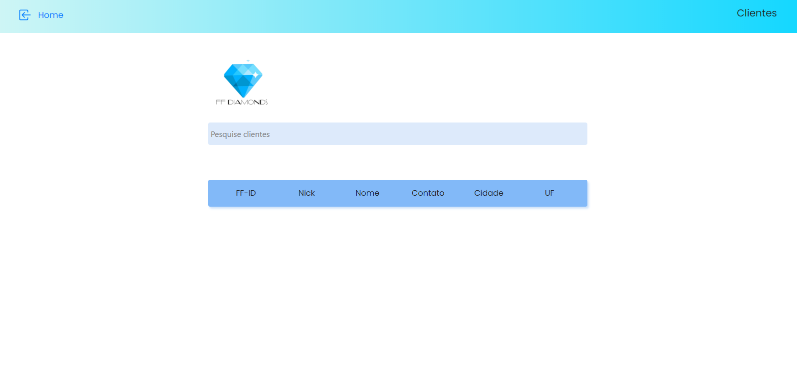
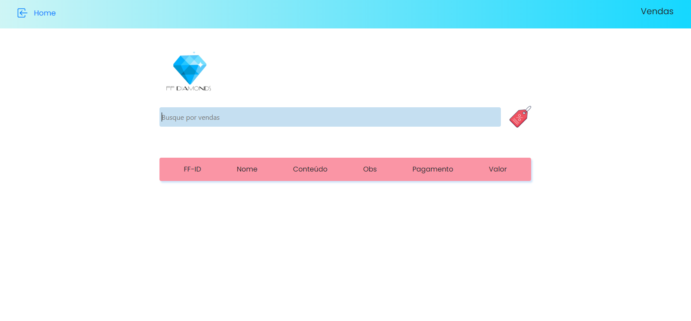

<h2>FFDIAMONDS</h2>

<strong>Sobre</strong>

Aplicação web feita para gerenciamento e  organização de clientes e vendas de uma lojinha virtual

<h2>Projeto Freelancer</h2>

<strong>Stack Utilizada</strong>

- Node

- React

- Typescript

<h3>Para mais informações sobre as funcionalidades da  aplicação, acesse o repositório que contém a API da mesma. #FFDiamondsAPI</h3>

